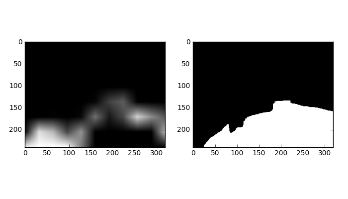
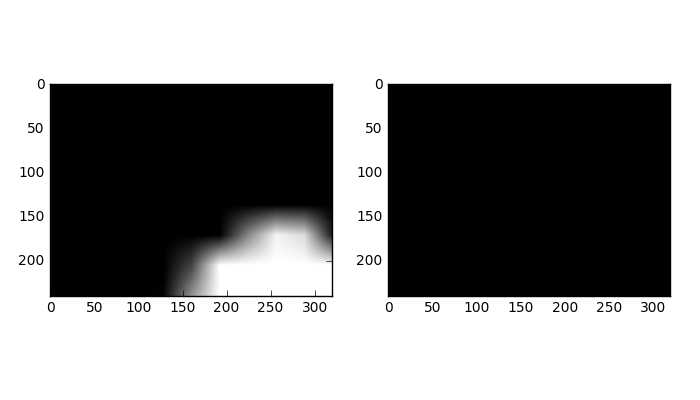
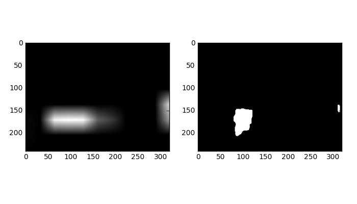

## Semantic Segmentation using Adversarial Training

Paper Ref :- [Semantic Segmentation using Adversarial Networks](https://arxiv.org/abs/1611.08408)

### Pytorch implementation 

Stanford Background Segmentation dataset is used. There are 8 classes. 
The label maps are one-hot-encodified and compressed and stored in HD5F format.

### Loss functions:

#### Discriminator's Loss 
`
Real_Loss = BinaryCrossEntropyLoss(discriminator(Real_Label_Map), Ones)
`
`
Fake_Loss = BinaryCrossEntropyLoss(discriminator(Fake_Label_Map), Ones)   // Fake label map =>  generated by the segmentor
`

### Segmentor's Loss 

`
SLoss =  CrossEntropy(Generated, Actual) + Lambda*BinaryCrossEntropyLoss(discriminator(Fake_Label_Map), Ones)
`

Prolonged access to GPU was not available. This was trained for 12 epochs with only 1 image per mini-batch ( lack of high memory GPU ).

The results are:-

<h1 align="center">
   
  
   
   
</h1>

	Class 1 :
   
  
   
   

	Class 2 :
   
  
   
   

	Class 3 :
   
  
   
   

	Class 4 :
   
  
   
   

	Class 5 :
   
  
   
   

	Class 6 :
   
  
   
   

	Class 7 :
   
  
   
   

	Class 8 :
   
  
   
   

